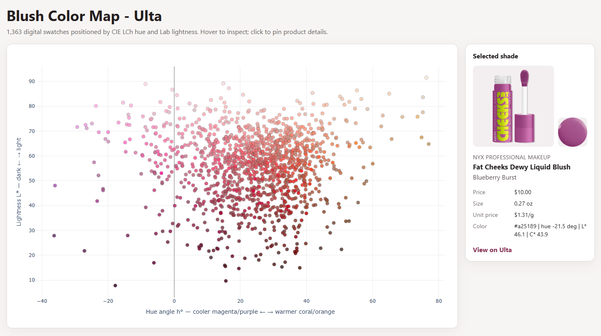

#  Ulta Beauty Product Data & Cosmetic Swatch Color Analysis

An end-to-end Python data engineering and image-processing project for
collecting, preparing, and analyzing cosmetic product data from Ulta Beauty.

The project builds reproducible product, variant, price, ingredient, and image datasets; classifies blush products by format; cleans product size and pricing data; and extracts representative sRGB, HEX, and CIE L*a*b* color measurements from digital makeup swatch images.

## What This Project Demonstrates
- ETL and normalized product-data pipelines
- Retail and e-commerce product analytics
- Data cleaning, validation, and feature engineering
- Cosmetic swatch image processing
- sRGB, HEX, and CIE L*a*b* color science
- Reproducible datasets, manifests, checksums, and checkpoints
- Python packaging, command-line interfaces, and automated testing

## Install

Use Python 3.11 or newer:

```powershell
python -m pip install -e .
```

## Configuration

Configuration is deliberately split into two files:

- `configs/scraper.toml` contains shared request, retry, delay, and checkpoint
  behavior.
- `configs/collections.toml` contains only named Ulta listing or product URLs.

To add skincare, body care, hair care, or another makeup category, add one
table to `collections.toml`:

```toml
[collections.body_lotion]
source_url = "https://www.ulta.com/shop/body-care/body-moisturizers/body-lotion"
source_type = "listing"
```

No Python change and no duplicate settings file are needed.

## Run

First discover a collection without scraping product pages:

```powershell
python scripts/scrape_ulta.py --collection blush --discover-only
```

Then run a small sample:

```powershell
python scripts/scrape_ulta.py --collection blush --max-products 5
```

Run another configured collection by name:

```powershell
python scripts/scrape_ulta.py --collection shampoo --max-products 5
```

A one-off Ulta listing or product URL is also supported. Shared scraper settings
still come from `scraper.toml`:

```powershell
python scripts/scrape_ulta.py `
  --url "https://www.ulta.com/p/example-pimprod123?sku=1234567" `
  --name "example_product"
```

Use `--settings` or `--collections` only when those files live somewhere other
than their default paths. Resume an interrupted v2 run with:

```powershell
python scripts/scrape_ulta.py `
  --collection blush `
  --resume-run "data/raw/blush/20260723T120000Z"
```

## Raw-data format (schema v2)

Each execution creates:

```text
data/raw/{collection}/{run_id}/
  run_manifest.json
  collection_products.csv
  products.csv
  variants.csv
  ingredients.csv
  failures.csv
  checkpoint.json
```

The tables have separate responsibilities:

| File | Grain | Purpose |
| --- | --- | --- |
| `collection_products.csv` | one discovered product | Crawl inventory, listing page, and listing position |
| `products.csv` | one product | Product identity, URL, rating, and review count |
| `variants.csv` | one SKU | Shade/variant identity, prices, size, availability, images, and ingredient-set link |
| `ingredients.csv` | one distinct formula per product | The exact raw ingredient text |

`ingredient_set_id` is a SHA-256 identifier computed from the product ID and
Unicode-normalized ingredient text. If all shades use the same formula, that
long ingredient list is stored once. If Ulta publishes different formulas for
different SKUs, each variant points to the correct formula.

Fields intentionally not collected include `summary`, `details`, `how_to_use`,
`currency`, and repeated `source_page`/collection metadata. `variant_image_url`
is retained. Row-level `observed_at` is not used: the run's `started_at` and
`finished_at` live once in `run_manifest.json`.

`variant_without_ingredients_count` in the manifest makes missing ingredient
content visible instead of silently pretending it was collected.

## Swatch color extraction

Color extraction is a separate, resumable processing stage. It does not change
the scraped or prepared variant dataset. The current blush input contains 1,365
unique color SKUs with 1,365 unique Ulta swatch-image URLs:

```text
data/processed_data/test/blushes/single_color_swatch_image.csv
```

Start with a five-row verification run:

```powershell
python scripts/extract_swatch_colors.py `
  --input "data/processed_data/test/blushes/single_color_swatch_image.csv" `
  --output "data/interim/blush/swatch_colors_sample.csv" `
  --limit 5
```

Then use a new output path for the complete dataset:

```powershell
python scripts/extract_swatch_colors.py `
  --input "data/processed_data/test/blushes/single_color_swatch_image.csv" `
  --output "data/interim/blush/swatch_colors.csv"
```

The command checkpoints every 25 attempted images and resumes from an existing
output. Each output row is keyed by `product_id`, `sku_id`, and
`swatch_image_url` and includes:

- median center-crop RGB and a derived HEX display value;
- CIE L*a*b* coordinates under the D65 reference white;
- source-image SHA-256 and dimensions;
- sampled-pixel count and `rgb_spread` for quality review; and
- the versioned extraction method, `center_median_srgb_v1`.

The failure CSV is an attempt log, so a temporary failure remains recorded even
after a later resume succeeds. Use `unresolved_row_count` in the manifest to
determine whether any swatches are still missing.

The center crop, background rejection, and median estimator come from the most
reliable versions in the earlier Ulta projects. Manual color patches and product
exclusions are intentionally not embedded in this measurement layer. Corrections
should be a separate, auditable cleaning table.

These values describe Ulta's digital swatch artwork. They do not directly
measure the physical cosmetic, its pigment formula, lighting behavior, or its
appearance on different skin tones.

## Interactive blush color map

Feature 1 is generated as a self-contained HTML report. It needs no database,
GPU, web server, or Conda-specific setup; the project `.venv` and any modern
browser are sufficient.

```powershell
python scripts/build_color_map.py `
  --variants "data/processed_data/test/blushes/cleaned/cleaned_single_blush.csv" `
  --colors "data/interim/blush/swatch_colors.csv" `
  --output "reports/interactive/blush-color-map.html"
```

The X coordinate is LCh hue angle across the blush-relevant
magenta/purple-to-coral/orange arc. The Y coordinate is Lab `L*` lightness.
These positions are calculated directly from color space; no machine learning
is involved. Hover shows brand, product, variant, price, size, unit price, hue,
lightness, and chroma. Clicking pins product and swatch images plus the Ulta link
in a details panel.

Generated HTML reports are ignored by Git because they embed Plotly and can be
rebuilt from the CSV inputs. The same Plotly figure can later move into Dash
when color clustering, nearest-shade selection, and ingredient filters require
server-backed interactions.



## Encoding policy

Ulta names and ingredients may contain French, Italian, and other non-ASCII
text. The pipeline:

1. decodes response bytes strictly, preferring UTF-8;
2. never uses replacement characters to hide decoding failures;
3. normalizes parsed text to Unicode NFC;
4. writes CSV as UTF-8 with BOM (`utf-8-sig`) for reliable Excel import; and
5. writes JSON as UTF-8 with characters preserved rather than escaped.

Raw text is not transliterated and accents are not removed. Tests include
`Lancôme`, `Crème`, `Città`, and `Peut Contenir` round trips.

## Responsible collection

The client is single-threaded, rate-limited, and retry-bounded. It does not
attempt to bypass blocks, authentication, or access controls. Review Ulta's
current terms and crawl guidance before large or scheduled runs.

## Tests

Tests use saved HTML and do not contact Ulta:

```powershell
python -m unittest discover -s tests -v
python -m compileall -q src tests scripts
```
